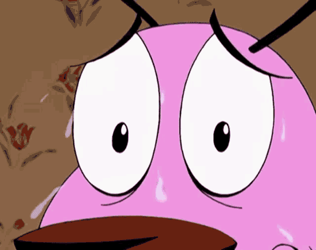

# 💖 Will You Be My Valentine?

An interactive web page designed to surprise and delight your loved one on Valentine's Day. It features a special question accompanied by a charming and playful experience.



---

## 🌟 Features

- **Engaging Interactivity**: Offers a question with options that dynamically react based on the user's choice.
- **Responsive Design**: Adapted to work seamlessly on both mobile and desktop devices.
- **Charming Visual Elements**: Includes images and styles that create a romantic and fun atmosphere.

---

## 🛠️ Technologies Used

- **HTML5**: Semantic structure of the web page.
- **CSS3**: Styling and responsive design.
- **JavaScript**: Interactive and dynamic functionality.

---

## 🚀 Getting Started

### Prerequisites

- A modern web browser (such as Chrome, Firefox, Safari, Edge).

### Steps to Run the Project

1. **Clone the Repository**:
    ```bash
    git clone https://github.com/rauljimm/wybmv.git
    ```
2. **Navigate to the Project Directory**:
    ```bash
    cd wybmv
    ```
3. **Open the Main File**:
    - Locate the `index.html` file in the cloned directory.
    - Open it with your preferred web browser.

---

## 💂️ Project Structure

- `index.html`: Main file containing the page structure.
- `style.css`: Stylesheet for design and visual presentation.
- `script.js`: JavaScript file handling interactivity and user actions responses.
- `assets/`: Folder containing images and other multimedia resources used on the page.

---

## 🤝 Contributions

This project was created as a personal gesture for Valentine's Day. However, suggestions or improvements are welcome. Feel free to fork the repository and propose changes.

---

## 📝 License

This project is licensed under the MIT License. See the [LICENSE](LICENSE) file for more details.

---

**Note**: This project was developed with love and dedication. It is recommended to customize the content to better fit your personal situation and relationship. Make your loved one feel special!
